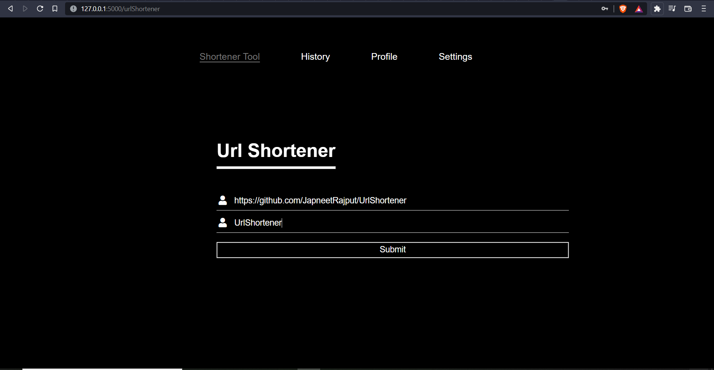
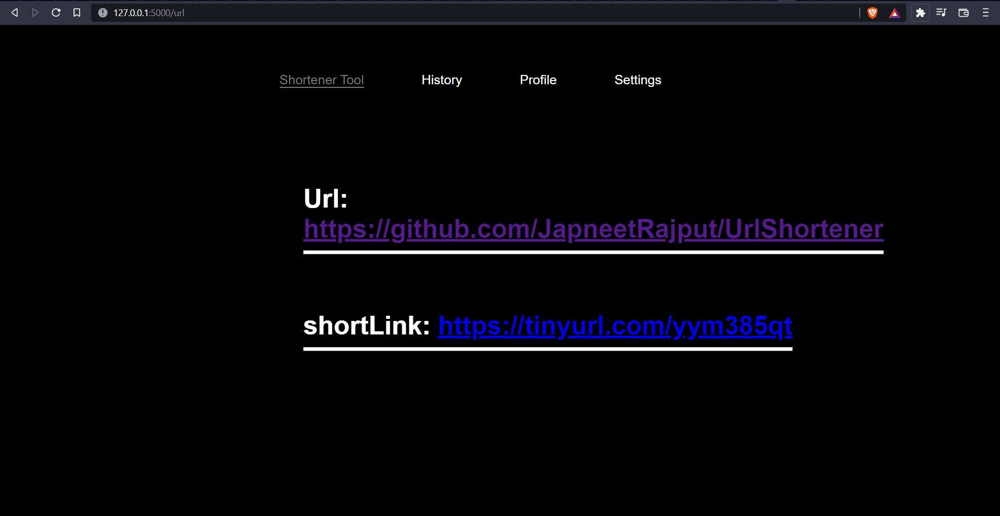

# Development
Please have python3 installed to run this project on terminal:
[Python3 Installation](https://www.python.org/downloads/)

# Project Title
<!--Remove the below lines and add yours -->
A URL Shortener is a tool that creates a short, unique URL that will redirect to the specific website of your choosing

## Prerequisites
<!--Remove the below lines and add yours -->
Modules used in this app are Flask and PyShortener.

Steps:

Start MySQL and Apache server on Xampp.

Initialize Database schema by going to MySQL Server admin page by passing the queries in initialize.sql

Install the Virtual Environment module

    pip install virtualenv

Create a virtual environment

    virtualenv venv

Activate the Virtual Environment

    venv\scripts\activate.bat

Install the required modules

    pip install -r requirements.txt

## How to run the project
<!--Remove the below lines and add yours -->
Steps:

Run the app 

    flask run

## Screenshots of the project
<!--Remove the below lines and add yours -->

## Author Name

[Japneet Rajput](https://github.com/JapneetRajput) 

[Portfolio Website](https://japneetrajput.github.io)