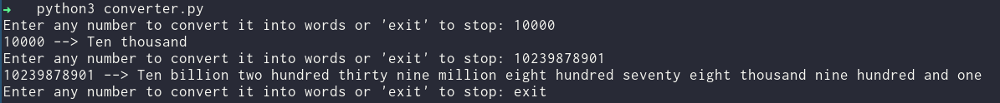

# Convert Numbers To Words
<!--Remove the below lines and add yours -->
Convert a number to the written word form

### Prerequisites
<!--Remove the below lines and add yours -->
None

### How to run the script
<!--Remove the below lines and add yours -->
Execute `python3 converter.py`

## Screenshot/GIF showing the sample use of the script
<!--Remove the below lines and add yours -->

## *Author Name*
<!--Remove the below lines and add yours -->
[Niraj Shrestha](https://github.com/CrestNiraj12)
