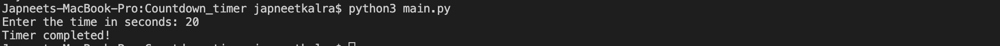

# Development
Please have python3 installed to run this project on terminal:
[Python3 Installation](https://www.python.org/downloads/)

# CountDown Timer
<!--Remove the below lines and add yours -->
Countdown timer made using the Python time module and is a terminal game to countdown the time.

### Prerequisites
<!--Remove the below lines and add yours -->
Modules required to be able to use the script successfully
and how to install them.
Please have python3 installed to run this project on terminal:


### How to run the script
<!--Remove the below lines and add yours -->
```code
python3 main.py
```
# Example
Enter the time in seconds: 20
00:20
Timer completed!

### Screenshot/GIF showing the sample use of the script
<!--Remove the below lines and add yours -->


## *Author Name*
<!--Remove the below lines and add yours -->
[JapneetSingh](https://github.com/japneetsingh035)