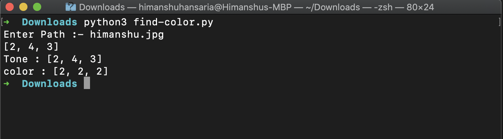

# Finding Dominant Color  

- This script will take a image and it will find dominant color in it .

### Prerequisites
- You only need to have installed opencv which is used for image preprocesssing.
- Run the below script to install opencv
- $ pip install opencv-python

### How to run the script
-Run below command 
- python find-color.py
- Now Enter the path for image 
- Copy Your image path and enter in the command

### Screenshot showing the sample use of the script

## *Author Name*
[Mitesh](https://github.com/Mitesh2499)
