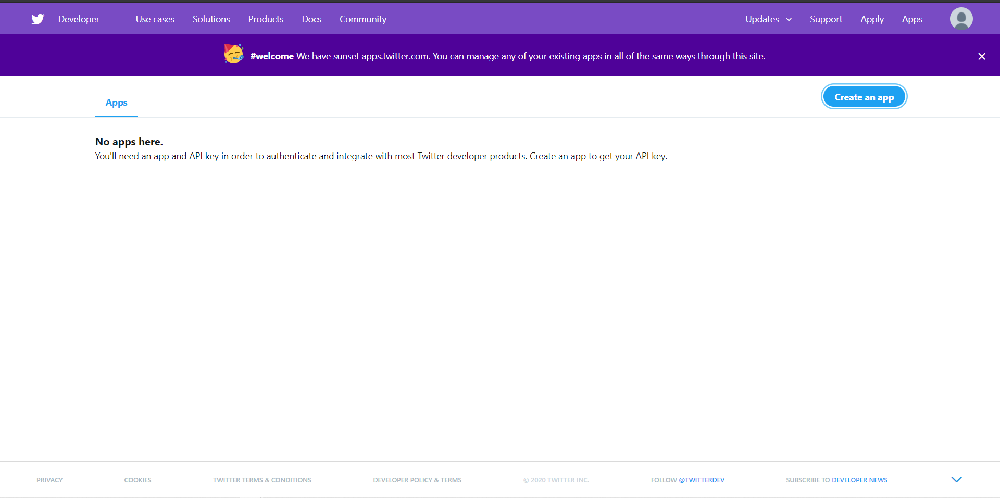
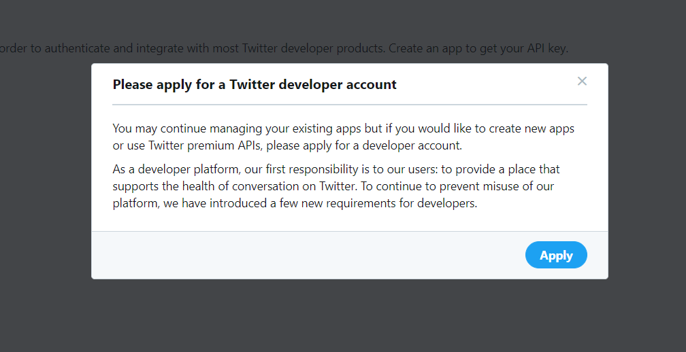
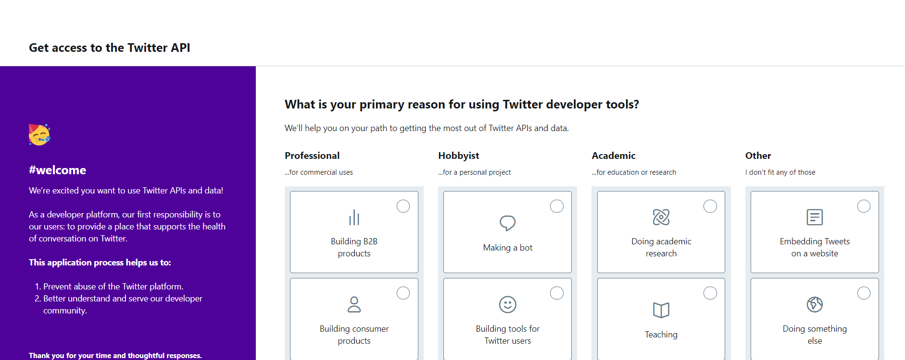
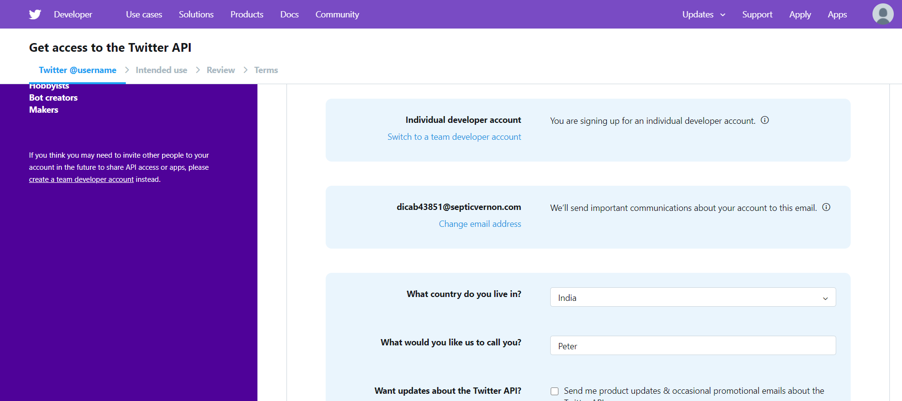
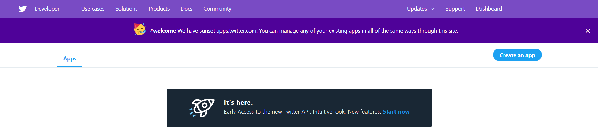
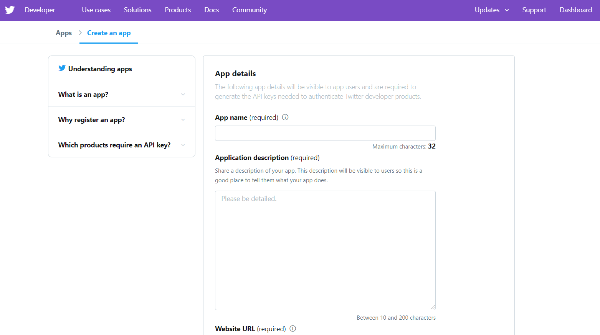
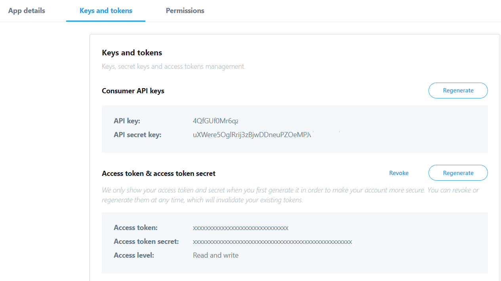
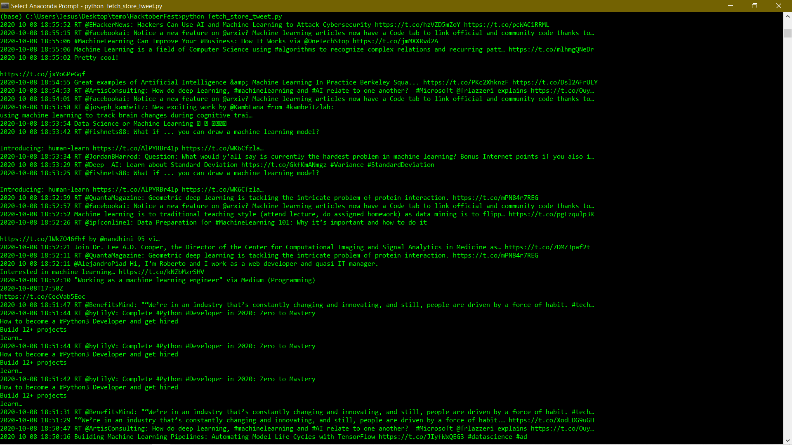
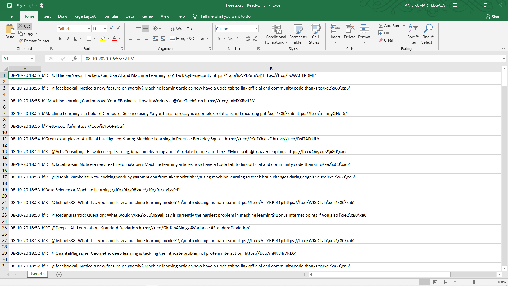

# Fetch and Store Tweets
This python script is used to fetch the required number of tweets of a particular Hashtag through your twitter account and  generates an `.csv` file. 

## Prerequisites

1. You need any Python IDE to run this script. You can visit [here](https://www.python.org/downloads/) to download the latest version of Python based on your operating System.

2. Next to execute this script you have to get the API keys from twitter developer account by creating an app at [Twitter developer account](https://developer.twitter.com/apps). For creating an app at  [Twitter developer account](https://developer.twitter.com/apps) you have to follow the below steps

    ### Step1: 

    Visit [Twitter Developer Account Website](https://developer.twitter.com/apps) and click on Create app as shown below

    

    ### Step2:

    Click on Apply

    

    ### Step3:

    Based on your choice select the Reason for using twitter developer tools and Click on Next



### Step4:

Enter your country and what you would you call and Click on Next



### Step5:

Now Carefully read the questions and answer all the questions as per the requirement. Because based on you answer only the account approval will be taken place


### Step6:

If your account successfully approved you can come to homepage  [Twitter developer account](https://developer.twitter.com/apps) and now click on Create an app icon on the right top.

**Note:** sometimes it takes time to approval of the developer account based on step-5 answers



### Step7:

Fill the require fields and click on Create



### Step8:

After creating the App click on **Keys and tokens** option you will observe Consumer and Access token keys. Copy them and paste them in the python script



## How to run the script

1. Save the script in the local machine.

2. Update the API and Access token Keys in the Python script which generated in step8

3. Open a terminal/command prompt and change directory location to the folder where your script is located and run the below commands

    1. To install required packages run the below command

        ```python
        pip install -r requirements.txt
        ```

    2. To execute the script run the following command

        ```python
        python fetch_store_tweet.py 
        ```

    After successful execution of the script you should observe the below output in command prompt/terminal as well as one `.csv` file with the required number of tweets will be generated.

    

    Final generated tweets in`.csv` file output

    

## Author Name

[Kushal Agrawal](https://github.com/kushal98)
