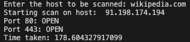

# Fetch open port
<!--Remove the below lines and add yours -->
This script finds open port for web address.

### Prerequisites
<!--Remove the below lines and add yours -->
No need for additional installations.

### How to run the script
<!--Remove the below lines and add yours -->
1. Clone repo on your local machine and switch to script folder
```
    git clone https://github.com/chavarera/python-mini-projects.git
    cd python-mini-projects/projects/Fetch_open_ports/
```

2. Run following command
```
    python3 fetch_open_port.py
```

3. Once script is running, you can write any website you want, and it will print all open ports in range 50-500.

### Screenshot/GIF showing the sample use of the script
<!--Remove the below lines and add yours -->


## *Author Name*
<!--Remove the below lines and add yours -->
[Kushal Agrawal](https://github.com/kushal98)
