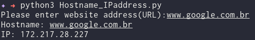

# Get Ipaddress and Hostname of Website
<!--Remove the below lines and add yours -->
Get the ip address and hostname of a website

### Prerequisites
<!--Remove the below lines and add yours -->
None

### How to run the script
<!--Remove the below lines and add yours -->
Execute `python3 Hostname_IPaddress.py`

### Screenshot/GIF showing the sample use of the script
<!--Remove the below lines and add yours -->

## *Author Name*
<!--Remove the below lines and add yours -->
[Nuh Mohammed](https://github.com/NuhMohammed)
