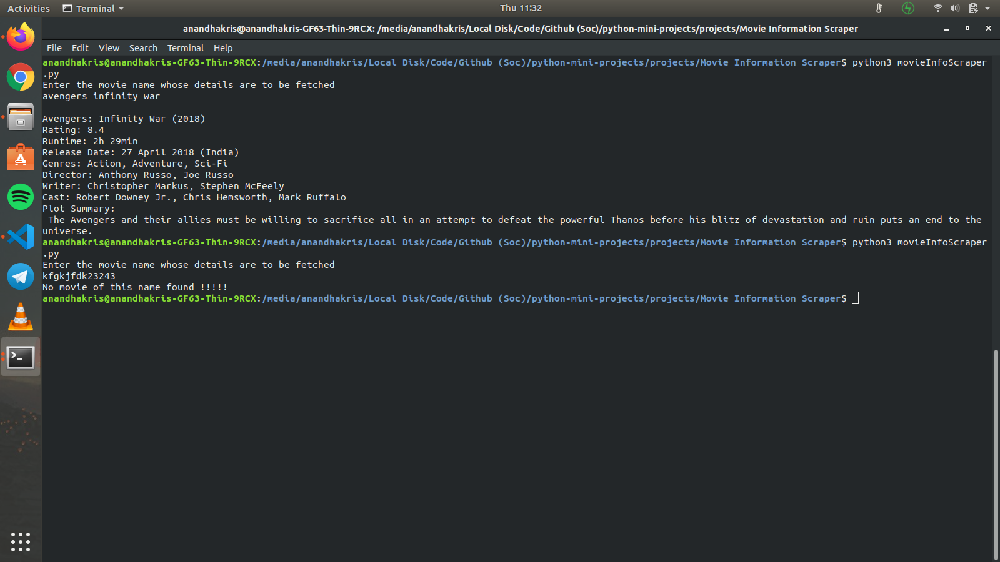

# Movie Information Scraper
This script obtains movie details by scraping IMDB website.

### Prerequisites
* beautifulsoup4
* requests
* Run `pip install -r requirements.txt` to install required external modules.

### How to run the script
Execute `python3 movieInfoScraper.py` and type in the movie name when prompted.

### Screenshot/GIF showing the sample use of the script
<!--Remove the below lines and add yours -->

## Author Name
[Anandha Krishnan Aji](https://github.com/anandhakrishnanaji)
