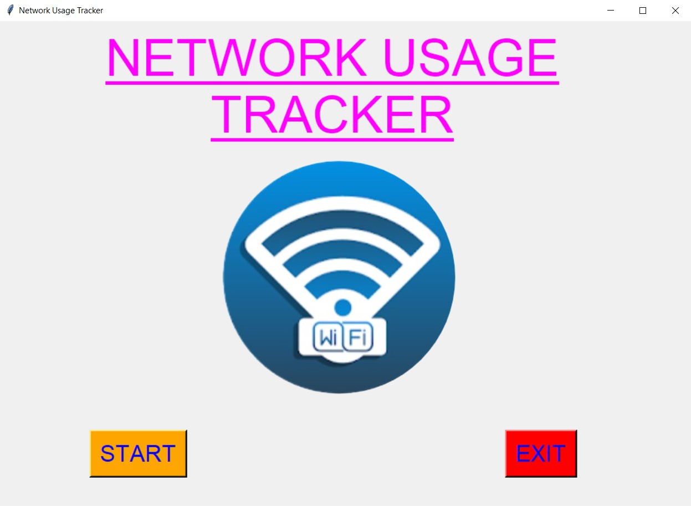
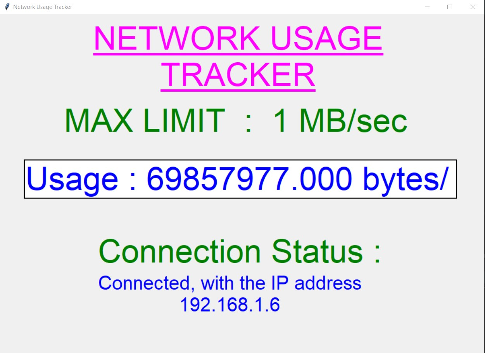
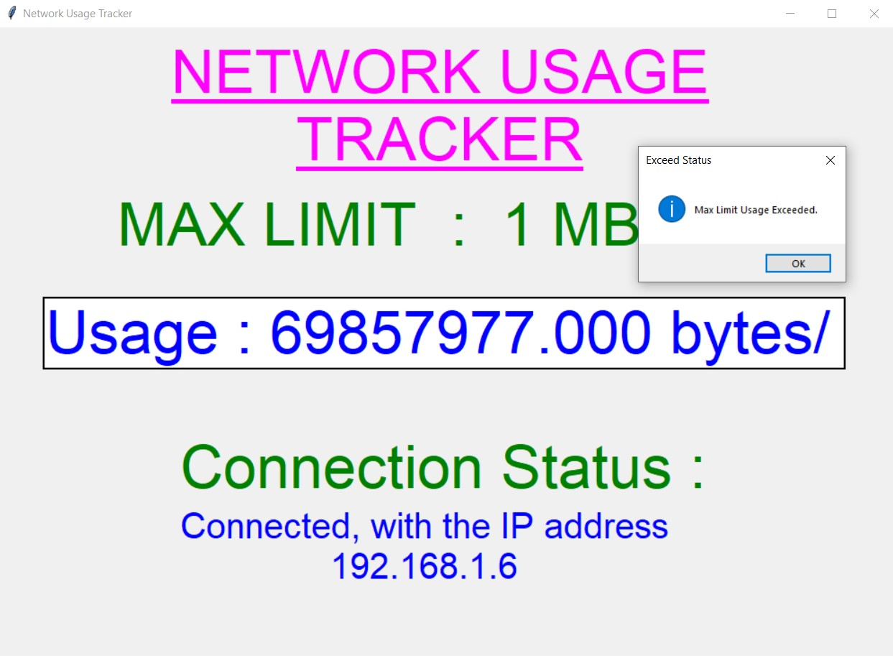
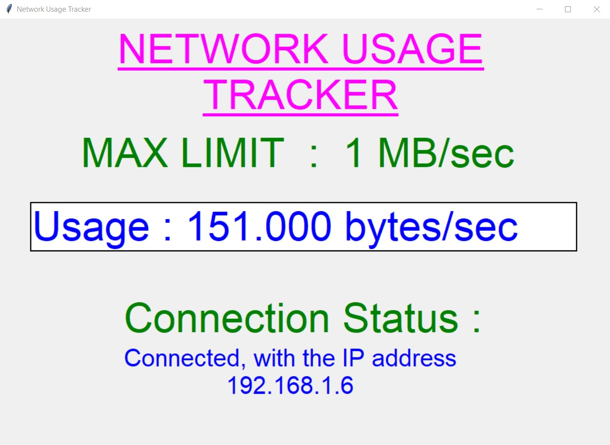
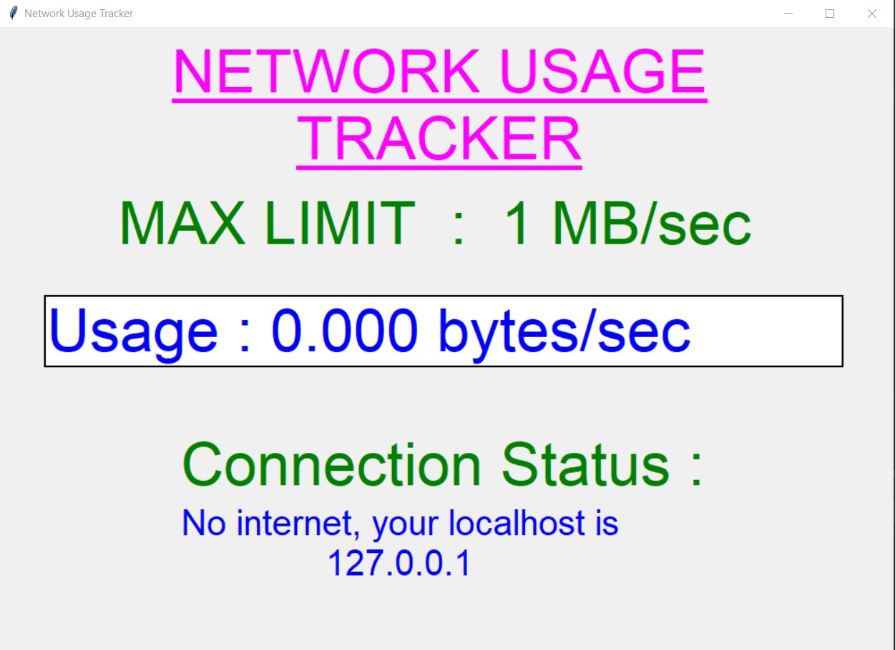
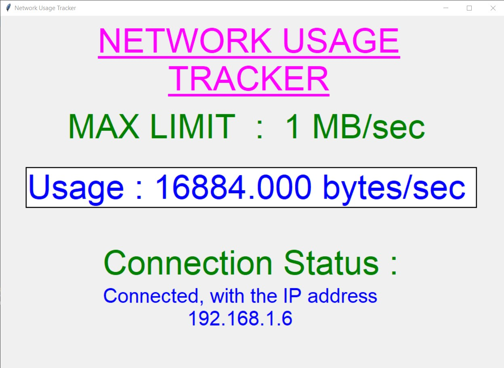
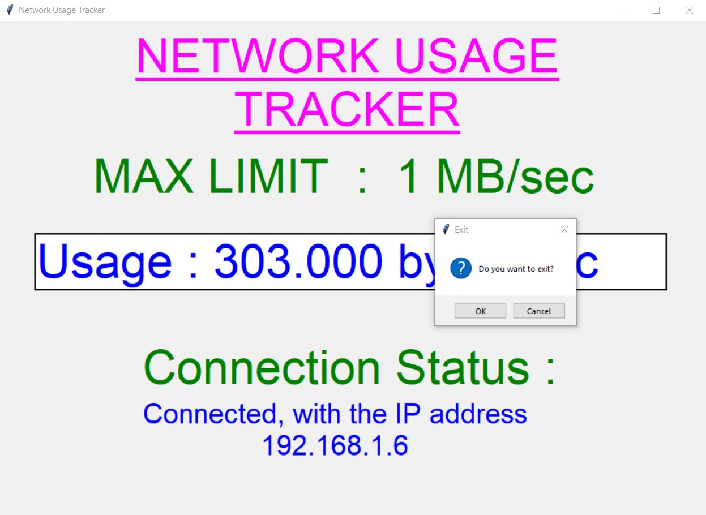

# Script Title
- A "Network Usage Tracker" is an application created in python with tkinter gui.
- In this application, user gets the usage of network in his/her PC or computer at every instant.
- Here user will be given a MAX LIMIT of network usage, and if user crosses that max limit, user willl be notified for the same.
- Also user will be able to see the connection status and the IP address related to the same.

### Prerequisites
```pip install -r requirements.txt```

### How to run the script
- Just clone the code file, and network_usage_tracker.py on local system.
- Then the script will start running and user can monitor the network usage and check if it exceeds the max limit or not.

### Screenshot/GIF showing the sample use of the script
<p align="center">
  <br>
  <br>
  <br>
  <br>
  <br>
  <br>
  <br>
  <br>
</p>
## *Author Name*
Akash Rajak