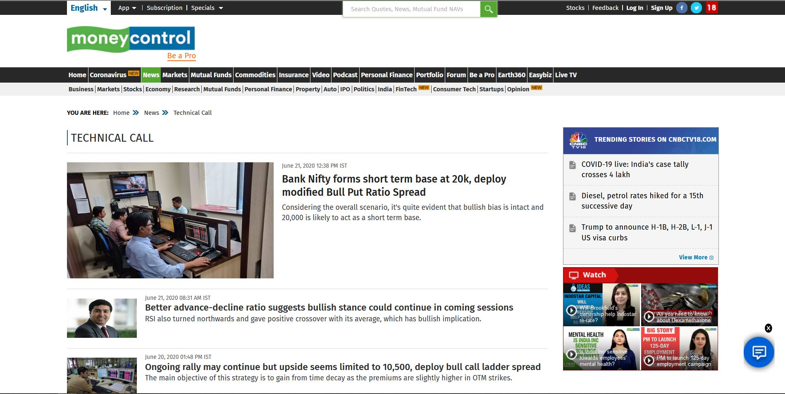
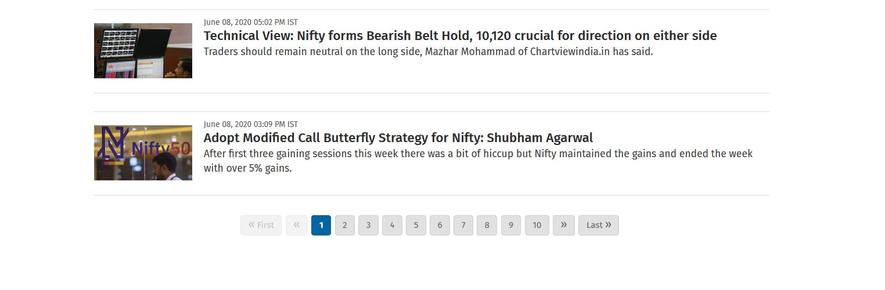
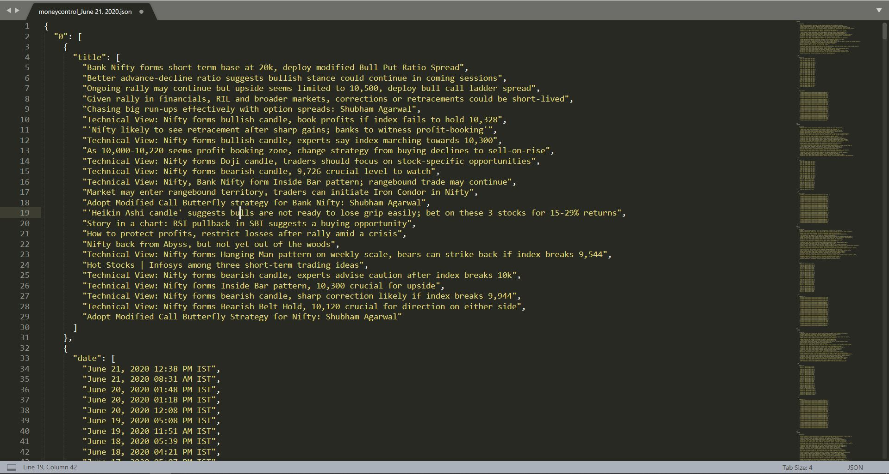

# Financial-news-scraper
A scraper made using beautiful soup 4 in python. Tailor made for extracting news from moneycontrol.com. Issue pull request for different scrapers.

__The main page to start scraping from: https://www.moneycontrol.com/news/technical-call-221.html__

__The program scrapes news from next pages too by extracting website link in these buttons__

__Resulting JSON file includes heading, date and image link, indexed by page number__

