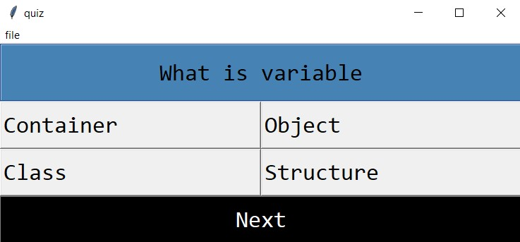
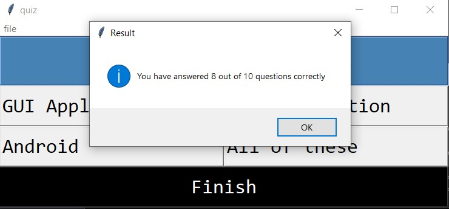

# Programming Quiz Project
The project is about developing a quiz of 10 questions using python programming language on graphical user interphase.

### Prerequisites
1. Tkinter

### How to run the script
<li> Download the prerequisited library using `pip install tkinter` command on the terminal/command prompt
<li> Run the Graphical user Interphase using `python Quiz.py`
<li> Go to <strong>file</strong> menu to select the programming language for the quiz.
<li> Click on start button to proceed with the quiz
  

<li> After successful submission, a popup will display the result

  
  
### Quiz Enhancement

<li> Changes in questions.py-:  
  1. Add questions que dictonary (eg java_que={0 : ...,1 : ...}) 
   
  2. Add option and answer to the answer dictonary ( eg java_ans={question : [options , correct answer]})
 
<li> Changes in Quiz.py  
  1. Add th course to the course() function (Line 15)
    
  elif s.get()=="Java":
             
            <lr> self.que=java_que
            <lr> self.ans=java_ans
   
  2. Add course to the file menu (Line 65) 
   
     course_menu.add_radiobutton(label="Java",value="Java",variable=s,command=obj.course)
 
<li> Save and run the script using the instructions given above

  
  ## *Author Name*
[Pulkit Dhingra](https://github.com/Pulkit12dhingra)
