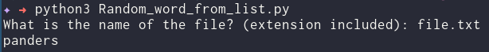

# Random word from file
<!--Remove the below lines and add yours -->
Get a random word from a file

### Prerequisites
<!--Remove the below lines and add yours -->
None

### How to run the script
<!--Remove the below lines and add yours -->
Execute `python3 Random_word_from_list.py`

### Screenshot/GIF showing the sample use of the script
<!--Remove the below lines and add yours -->

## *Author Name*
<!--Remove the below lines and add yours -->
Ravi Chavare
