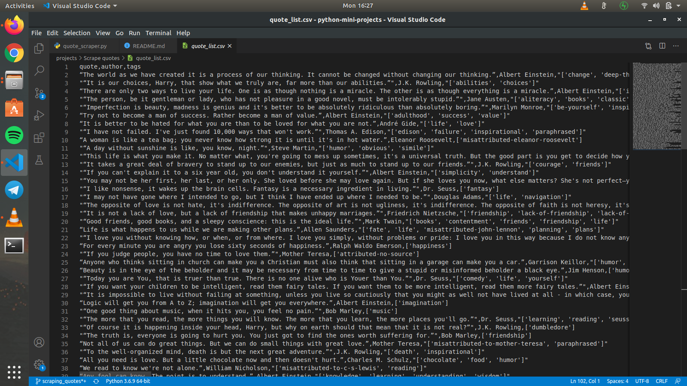

# Quote Scraper
This script scrapes quotes from [Quotes to Scrape](http://quotes.toscrape.com)

### Prerequisites
* beautifulsoup4
* requests
 Run `pip install -r requirements.txt` to install required external modules.

### How to run the script
Execute `python3 quote_scraper.py`

### Screenshot/GIF showing the sample use of the script
<!--Remove the below lines and add yours -->

## Author Name
[Anandha Krishnan Aji](https://github.com/anandhakrishnanaji)
