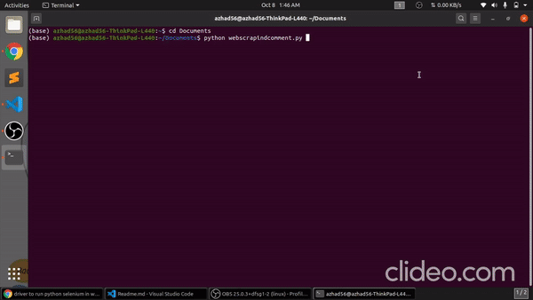

# Web Scrapping Comment 
- This script will take a url of youtube video and it will give csv file for users and comments .

### Prerequisites
- You only need to have installed selenium which is used for automation.
- Run the below script to install selenium
- $ pip install selenium

### How to run the script
- Simply replace your own youtube video url in the webscrapindcomment.py
- And run command in the same directory
- python webscrapindcomment.py

### Screenshot/GIF showing the sample use of the script

## *Author Name*
[Saicharan67](https://github.com/Saicharan67)
