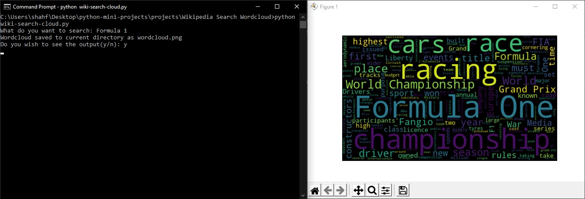

# Wordcloud Images for Wikipedia Article
Python script that prompts the user for an input, searches for the corresponding article on wikipedia and generates a wordcloud based on the searched article.

### Prerequisites
`pip install` the models in `requirements.txt` from your command prompt.

### How to run the script
Run like any other python file. Upon executing, the wordcloud image will be saved to the current directory. The script will also prompt a y/n if the user wants to see the generated image during execution.

## *Author Name*
[Naman Shah](https://github.com/namanshah01)
