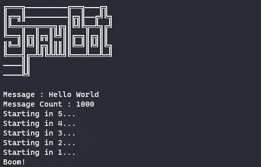

# Spam Bot

A simple spam bot written in python.

### How to use

First, you need to install necessary dependencies to run the program.

`pip install -r requirements.txt`

Then, run the _spam-bot.py_ and then quickly switch tabs to whatever app you want to spam in and select the box to type in. (You have only 5 seconds to do this after running the spam-bot.py)

To stop the program, move your mouse to the upper left corner of the screen.

### Author

[Hirusha Pramuditha](https://github.com/HirushaPramuditha)
